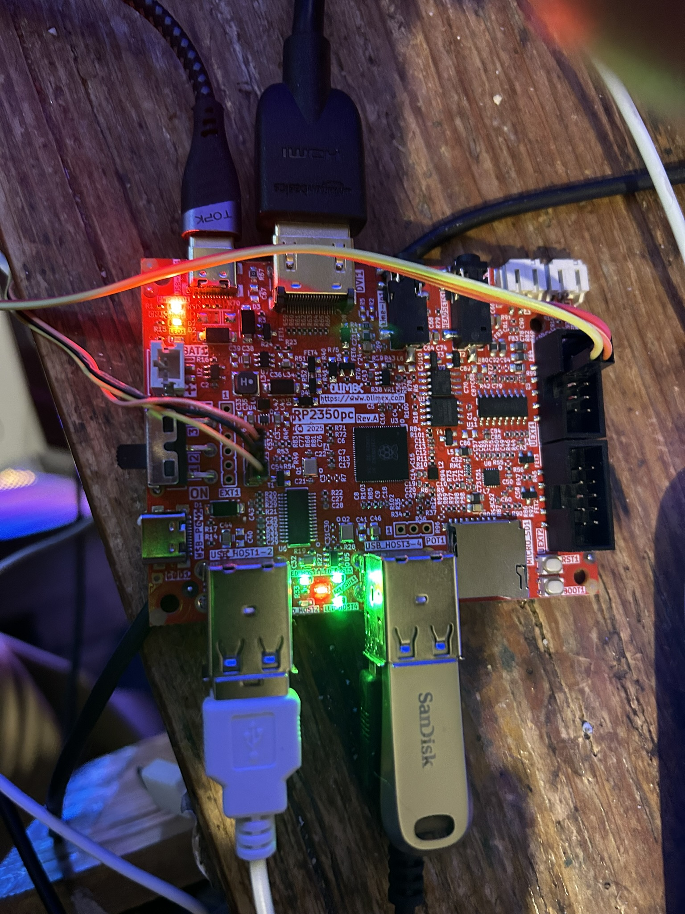

## Getting Started

The picture below shows the basic set up. There is no sound or microphone connections, and the SD Card is not currently working. 

Along the top, there is a data/power connection and a DVI/HDMI connector. 

If you want to load a file onto the board using UF2 files (boot mode) by holding boot and pressing and releasing reset, then releasing boot, you need a data connection connected into the USB-C connector on the left hand side of the board beneath the switch.

The slide switch is the main power, this position (e.g. towards the USB hubs) is on.

You can see 4 USB devices plugged into the hb, a Sandisk USB key, a keyboard, and a USB mouse. The spare slot is for a game controller. Currently only the Olimex type SNES controller is supported, though it isn't difficult to add others.

## Debugging

The board is set up for debugging. There are two connectors from the 'standard debug device' (the little 1" square box). On the right, there are three connections to the USB serial port. On the left, the debug connector. 

The picture below is the same image with the connectors removed so you can see the colouring of the plugs in the connectors.

The RP2350PC does not come with the pins soldered in to the connector nearest the toggle switch (or my prototype didn't) so you may have to solder in 3 x 0.1" pins to make this connection.

## Building

Two things are required. One is the Pico SDK, which can be downloaded or git cloned.

The second is the RISC-V compiler which is here https://embecosm.com/downloads/tool-chain-downloads/#corev and the usage is described here https://www.cnx-software.com/2024/08/31/using-risc-v-cores-on-the-raspberry-pi-pico-2-board-and-rp2350-mcu-from-blinking-an-led-to-building-linux/ 

I used the Ubuntu 22.04 one which works fine on Arch Linux.

The locations of these are in pico.linux.make in the environment directory. 

If anyone would fix this for Windows (can't abide it) or Macs (not a billionaire) it would be much appreciated.

OpenOcd is also required if you are going to upload via the debugger rather than rebooting, which is a bit long winded even with a reset and boot button on the board. I think the one downloaded from the Raspi website is required.

It should compile quite happily under ARM if you want ; just change the paths and/or the platform. I notice you can't simply "just change it", it builds fine but won't upload, I wonder if you need to boot it and upload an ARM UF2 ?

## Code

This is a brief description on how the module/runtime system works, a better one will be written later.

### Modules

The code is not a big lump like previously, it is divided into hierarchical modules. 

At present there are only

- Common : this provides some common functions
- DVI : this provides the low level DVI interface
- USB : this provides the low level USB interface for HID devices (mouse, keyboard, gamepad) and MSC devices (USB key) and File Input/Output
- Input : this takes the USB input and converts it to ASCII with localisation, tracks the mouse position, and reads the gamepad. One gamepad only is supported, if none is provided the keyboard is used for Gamepad 1.

Each module has a simple demo (except common) in app/main.c which shows the various functionalities.

These are designed to do the bare minimum to abstract the hardware ; the user can use as much or as little as they want. Plans include for example a function to provide standard modes (the DVI module just does enough to generate video), and graphics functions on top of that etc.

Each function is build using cmake. There is a Makefile which has several options 

- make cmake : this rebuilds the Make structure so you can actually build it
- make compile : this compiles the code
- make upload : this uploads it to the board using openocd
- make monitor : this starts the serial TTY program picocom to see what's coming off the board
- make all : does compile upload monitor to run a program

There is nothing for PSRAM, the Codec chip, or PWM audio yet because I haven't looked at it.

### Runtime

The runtime, which is under development, is a PC/SDL based version of the low level modules (e.g. common, dvi and usb) so that programs can be developed without having to upload all the time. It's not an emulator (it's not speed limited, and some things won't work). 

Paul Robson

6 July 2025