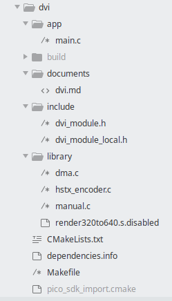

# Modules

Modules are either libraries, or applications, or both. The application can either be something in of itself or it can be a test for the library. 

Modules are a standalone entity that can be built using cmake (this can be done with the provided Makefile), or can be included in other modules.

## Elements of Modules

This is from my Sublime Text folder tree, and it's the module for "dvi", the library which provides low level interface to the HSTX system.

### app directory

This contains application files, which can be any C file or files, but is main.c here. 

There are three things to note :

1) the main function is not called main() but is called MAINPROGRAM()
2) infinite loops are not while(true) but while (COMAppRunning())
3) routines call YIELD() periodically

All of these are related to the runtime system, which allows running of these apps on a PC. It uses SDL which is an event driven system, so it has to yield periodically to redraw the display, and infinite loops will make an app unable to close. MAINPROGRAM() exists because there is a wrapper main() in the runtime.

### build directory

This is set up by cmake for building the applications. It is grey because git ignores it.

### documents directory

This provides a blank .md file to encourage you to write markup documentation.

### include directory

There can be any number of files here, but there are always two that here are dvi_module.h and dvi_module_local.h ; the former is external linking, and the latter is for library internals, say functions, types and structures you do not wish to expose. You can access pico functions here but they must be #ifndef RUNTIME/#endif wrapped ; the runtime does not provide virtually all of the SDK functionality.

### library directory

This is the sources files for the library. It picks up source files, which is why a file is typed as 'disabled', if it wasn't it would be picked up automatically.

### others

#### CMakeLists.txt

The CMake file

#### dependencies.info

A list of other modules this module requires

#### Makefile

A makefile which simplifies building using cmake as it provides the parameters etc. from the environment subdirectory

### pico_sdk_import.cmake

A requirement

## builder.py

The alert viewer will have noticed that there is a Python script "builder.py" in the module root. This is under development and will end up as a CLI app, but is still useable. The code

    ms = ModuleSet()
    ms.addModule("usb")
    ms.addModule("dvi")
    ms.addModule("input")
    ms.renderBuild("test")

sets up a new module set, adds three dependent modules (common is added automatically) and creates a set of directories and default files with which to work in the directory "test". It'll end up with parameters, but you can use it by editing the script now, and it seems to work. It will **not** overwrite any existing file.

It's still under development, but works well enough.

Paul Robson 

7th July 2025